<div align="center">


# PiShift

### A better desktop home for Oh My Pi.

The real `omp` terminal, plus tabs, a chat view, model controls, live agent activity, and a workspace that doesn't fight you.

[](https://github.com/Dazaike/pishift/releases/latest)
[](https://github.com/Dazaike/pishift/releases/latest)
[](https://github.com/Dazaike/pishift/releases/latest)
[](LICENSE)

**[Download PiShift](https://github.com/Dazaike/pishift/releases/latest)** · **[See screenshots](#screenshots)** · **[Explore features](#features)** · **[Build from source](#build-from-source)**

</div>


https://github.com/user-attachments/assets/77893a2d-dee0-4c13-bcfa-d7c2438e195d


---

## Meet PiShift

[Oh My Pi (`omp`)](https://github.com/can1357/oh-my-pi) is powerful. Managing multiple sessions, switching models, following agent activity, and working with images shouldn't make the terminal the hardest part of your workflow.

**PiShift puts a desktop interface around the actual `omp` engine.** You keep the terminal and gain a dedicated chat view, a control dock, searchable session history, split-screen workspaces, and live usage information. The terminal is rendered with xterm.js and WebGL; on Windows, it uses ConPTY to connect to the real CLI.

<p align="center">
  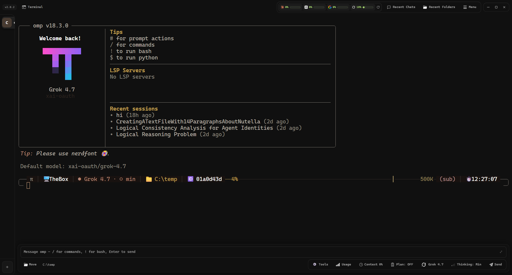
</p>

## Why use it?

| Instead of… | You get… |
| :--- | :--- |
| Juggling separate terminal windows | Tabs, workspace switching, and two sessions side by side |
| Reading every conversation in terminal scrollback | A structured chat view with transcript backfill |
| Memorizing commands to change models and reasoning | Model and thinking-effort controls in the dock |
| Guessing what an agent is doing | Live activity, tool calls, job status, and usage information |
| Rebuilding your setup every time | Persistent interface settings, recent sessions, and 28 themes |

## Download & install

Get the latest build from **[GitHub Releases](https://github.com/Dazaike/pishift/releases/latest)**. Choose the file for your system:

| Platform | Download type |
| :--- | :--- |
| Windows | Setup `.exe` installer or portable `.zip` |
| Linux (x64) | Portable `.AppImage` or Debian/Ubuntu `.deb` package |

> PiShift is a desktop interface for **Oh My Pi**. See the [Oh My Pi project](https://github.com/can1357/oh-my-pi) for information about the underlying CLI. Release filenames and version numbers may change, so use the latest release page rather than an old filename copied from this README.

## Screenshots

### Two ways to work

**Chat view:** Read the conversation, reasoning, and tool activity in a structured layout.

<p align="center">
  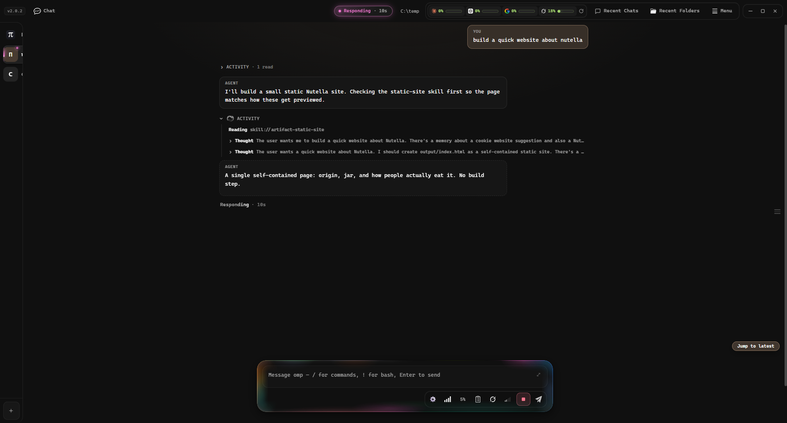
</p>

**Terminal view:** Work directly with the CLI without leaving the same app or workspace.

<p align="center">
  
</p>

### Model, thinking, and context controls

Switch models, change thinking effort, or check how much context is left without digging through commands.

<p align="center">
  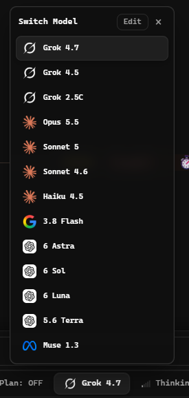
  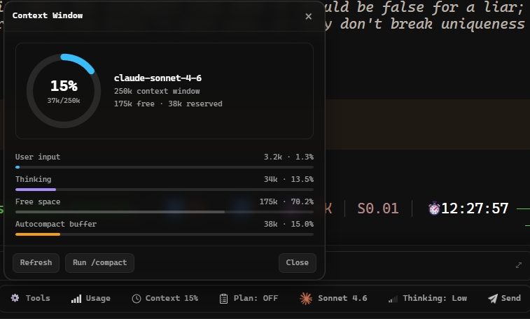
</p>
<p align="center">
  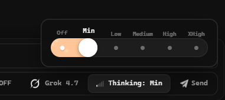
</p>

### Make the workspace yours

Pick a theme and adjust the interface, tabs, composer, and usage display.

<p align="center">
  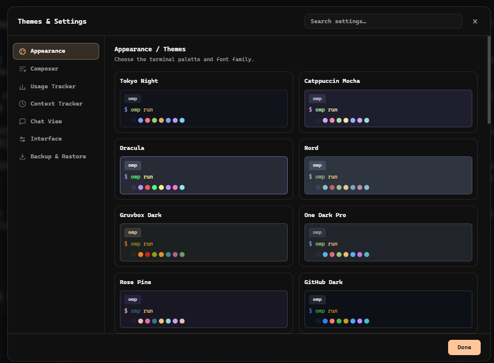
</p>

<details>
<summary><strong>More screenshots</strong> · sessions, usage, and interface options</summary>

<br />

**Recent sessions and workspaces**

<p align="center">
  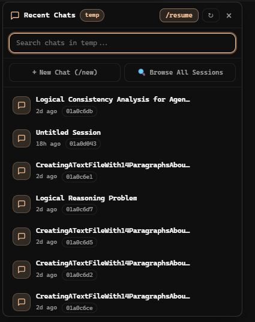
  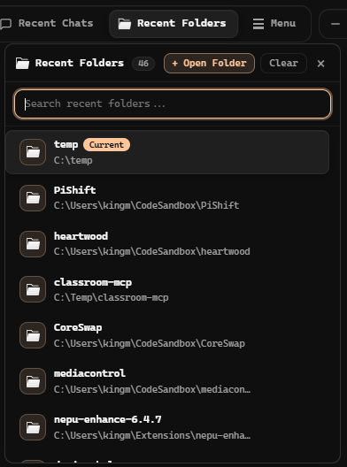
</p>

**Live sessions and provider usage**

<p align="center">
  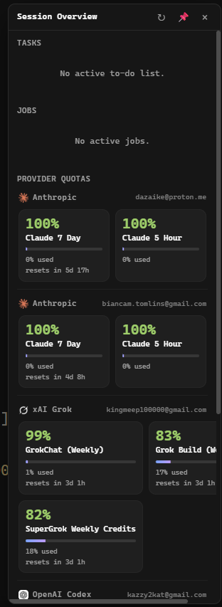
  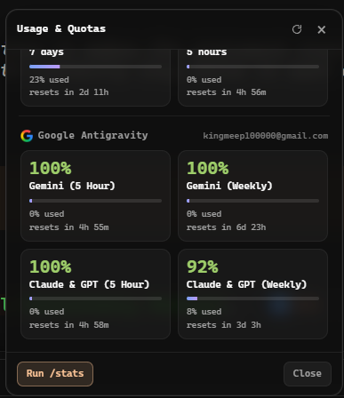
</p>

**Usage tracker and interface settings**

<p align="center">
  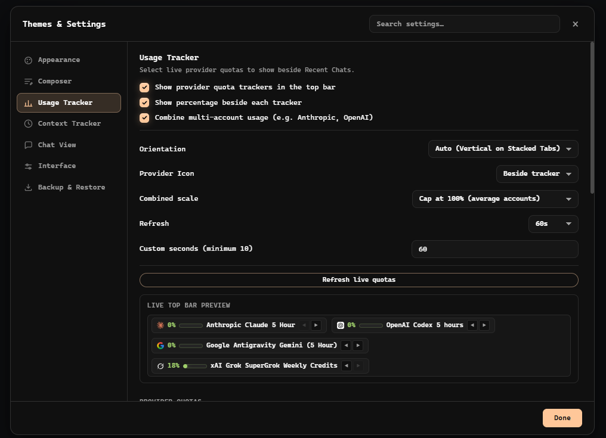
</p>
<p align="center">
  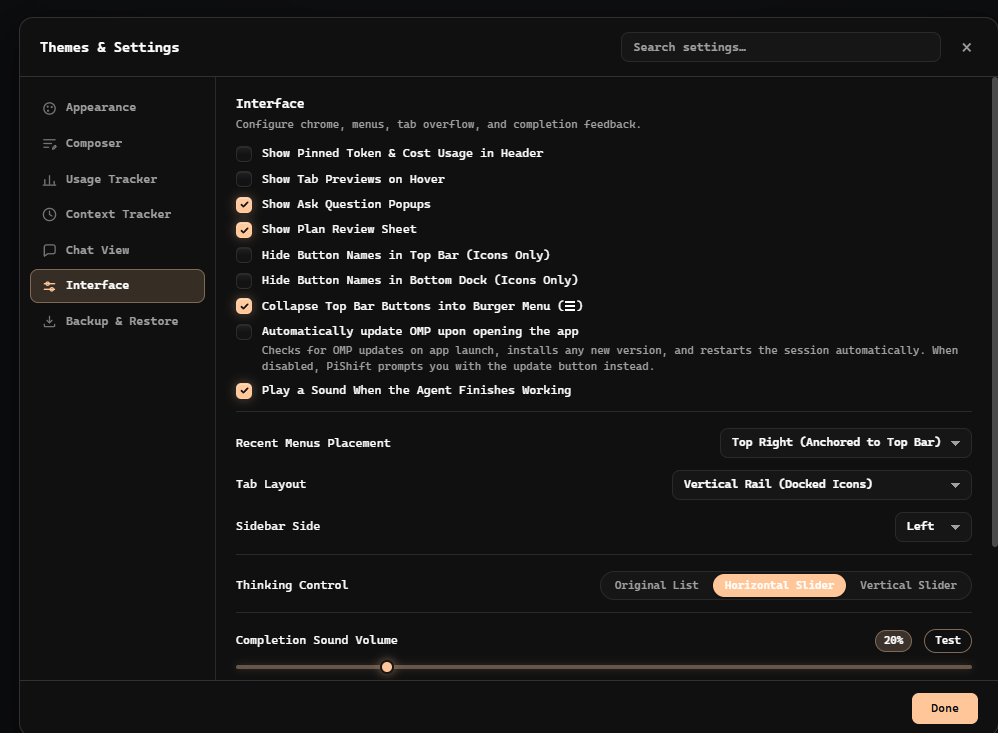
</p>

**Chat view, ready for a new conversation**

<p align="center">
  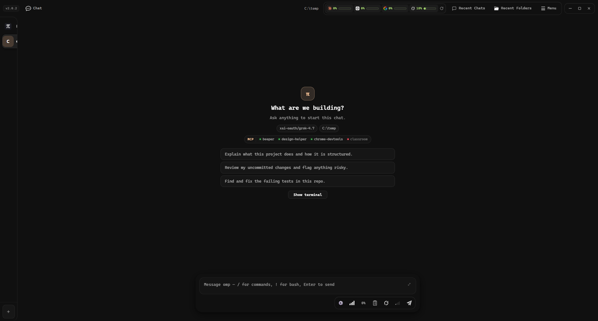
</p>

</details>

## Features

### 🖥️ A real terminal, with a better interface

- **WebGL-rendered xterm.js terminal** connected to the actual CLI. On Windows, PiShift uses ConPTY.
- **Terminal and chat views** for each tab, including previous messages when you resume a session.
- **Tabs and split screen:** organize workspaces, drag tabs into order, and run two sessions with a resizable divider. Your split ratio persists across restarts.
- **Terminal tools in one place:** find, copy, paste, clear, zoom, expand the composer, and restart a session.
- **Keyboard and image handling:** Kitty keyboard protocol support; drag-and-drop image chips with a full-resolution lightbox. OMP image content uses a text-attachment fallback in the terminal to avoid graphics-frame rendering problems.

### 🧠 Control the agent without interrupting it

- **Model picker:** grid or list view, editable custom model details and icons, and drag-and-drop ordering.
- **Thinking selector:** `Off`, `Min`, `Low`, `Medium`, `High`, `XHigh`, and `Max`.
- **Context breakdown:** see total and available tokens, the auto-compaction reserve, and usage across input, thinking, output, and tool calls; trigger `/compact` from the popover.
- **Plan mode:** shows the actual state reported by omp, including when it is paused, rather than assuming a button click succeeded.
- **In-app prompts:** review plans and answer agent questions without navigating terminal menus. You can keep these interactions in the terminal instead if you prefer.

### 📡 See what's happening live

- **Live agent status:** track idle, working, and thinking states, active tool calls, model changes, and token usage.
- **Background job monitor:** inspect runtime, reports, raw logs, and available thinking details; copy a finished report or stop a runaway job.
- **Usage and provider quotas:** view model availability and provider limits, with optional gauges in the top bar.
- **Session history:** search recent chats and folders, reopen workspaces, and restore the earlier conversation in Chat View.
- **Completion and recovery cues:** optional completion chime, activity indicators, elapsed time for long-running tools, and explicit Resume or Kill controls for stalled output.

### 🎨 Make it feel like your workspace

- **28 built-in themes**, including Tokyo Night, Catppuccin, Gruvbox, Nord, Cyberpunk, Rose Pine, and Synthwave.
- **Three tab layouts:** docked vertical rail, floating/auto-hide rail, or compact horizontal tabs.
- **Customizable chrome:** pin usage gauges, switch to icon-only controls, adjust top-bar layout, and preview inactive tabs.
- **Composer options:** multi-line expansion, real-time Markdown highlighting, long-paste handling, and configurable paste-marker styles.
- **Persistent preferences:** choose terminal fonts, activity-glow colors, scrolling behavior, recent-menu placement, and completion-sound volume.

<details>
<summary><strong>Explore advanced features and implementation details</strong></summary>

<br />

#### Session and workspace controls

- Right-click tabs to open the directory in File Explorer, copy its path, duplicate the tab in the same directory, assign a project color, rename it, or close neighboring tabs.
- Toggle split screen from the top bar, menu, tab context menu, or `Ctrl+\`. Drag the divider to resize; double-click it to return to an even split.
- Use the top bar as a window drag surface while keeping its buttons interactive.
- Switch recent chats and recent folders from searchable popovers. Tab titles and busy indicators follow the agent's reported state.

#### Composer and interaction details

- Type `/` for interactive slash-command suggestions.
- Press `Ctrl+Shift+Enter` to focus the composer; press it again to expand the prompt sheet.
- Long pastes (over 10 lines or 1,000 characters) can become a wrapped block, a local file, or inline text. Choose per paste or set a default.
- Customize paste markers with five styles and five visual treatments, plus an optional arrival flash.
- Answer `ask` prompts in an in-app modal; use inline question cards with multi-select, recommended choices, and an Other field.
- Review a plan with Approve, Compact, Refine, or Quit actions. The terminal-based interaction remains available in Settings.
- Open a workspace path directly in File Explorer from the dock.

#### Live integration with omp

- PiShift uses an asynchronous, loopback-only UDP bridge on `127.0.0.1` with a per-instance negotiated port. It streams agent activity and usage without repeatedly polling the agent.
- A file-watch fallback helps recover status when a datagram is missed. PTY output uses watermarked flow control to reduce unnecessary stalls when rendering falls behind.
- On launch, PiShift installs `control-bridge.ts` into `~/.omp/agent/extensions/` to connect the interface with agent activity.
- Installed models, recent sessions, and provider quota data come from omp's own data rather than a manually maintained model list.
- A compact activity layout keeps tools and thoughts folded by default; Detailed opens them on arrival. You can also show raw text when expanding an item.
- An activity orb reflects the agent's current work, while background jobs expose reports and logs separately.

#### Updates and settings

- PiShift can show an update prompt for the underlying OMP engine, update it in-app, and restart the active session.
- Optionally check for and apply OMP updates when PiShift opens. The header displays the OMP version.
- Configure quota-gauge style (bar, battery, or circle), ordering, refresh interval, and whether gauges appear in the header.
- Adjust composer glow by activity, busy-tab indicator colors, hover previews, scroll-wheel steps, and window layout.

</details>

## Keyboard shortcuts

| Shortcut | Action |
| :--- | :--- |
| `Ctrl+Shift+Enter` | Focus composer; press again to expand it |
| `Ctrl+Shift+T` | Open a tab in the current working directory |
| `Ctrl+Shift+W` | Close the active tab |
| `Ctrl+Tab` / `Ctrl+Shift+Tab` | Next / previous tab |
| `Ctrl+\` | Toggle split screen |
| `Ctrl+Shift+U` | Toggle Chat View / terminal |
| `Ctrl+Shift+F` | Find in terminal output |
| `Ctrl+=` / `Ctrl+-` / `Ctrl+0` | Zoom in / out / reset |
| `Ctrl+C` | Copy selection, or send `^C` if nothing is selected |
| `Alt+↑ ↓ ← →` | Send arrow keys to the agent from the composer |
| `Esc` | Cancel or dismiss the active overlay |

## Build from source

```bash
git clone https://github.com/Dazaike/pishift.git
cd pishift

bun install
bun run dev
```

To create distributable builds:

```bash
bun run dist
```

> These are the development and packaging commands provided by the project. Platform-specific build prerequisites and output formats may depend on your environment.

## License

Released under the **MIT License**. Do whatever you want with it, just PLEASE don't make it worse😭.

<div align="center">

**[Download PiShift](https://github.com/Dazaike/pishift/releases/latest)** · [Back to top](#pishift)

</div>
